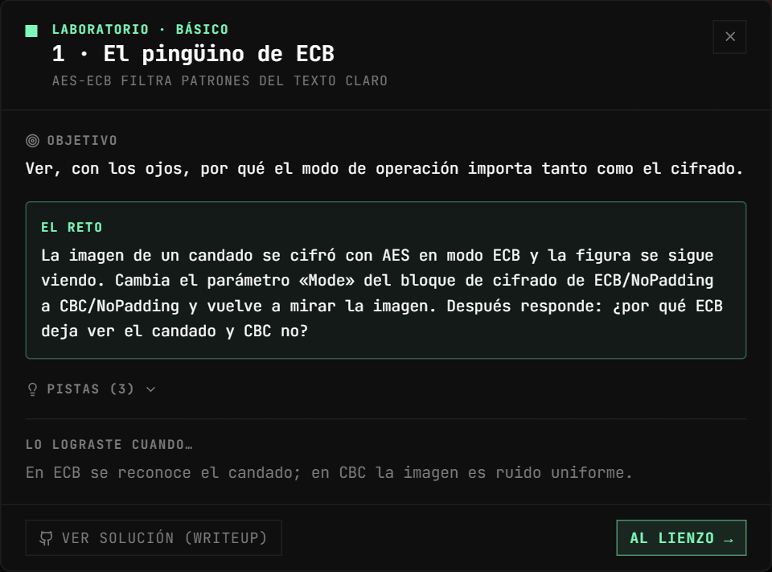
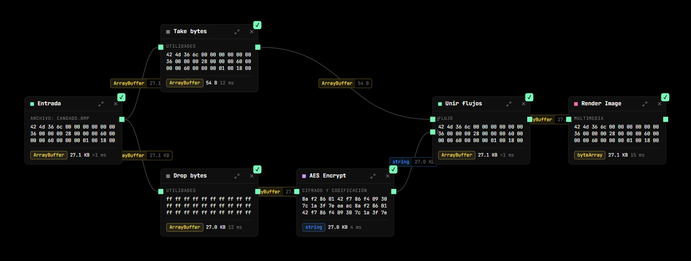
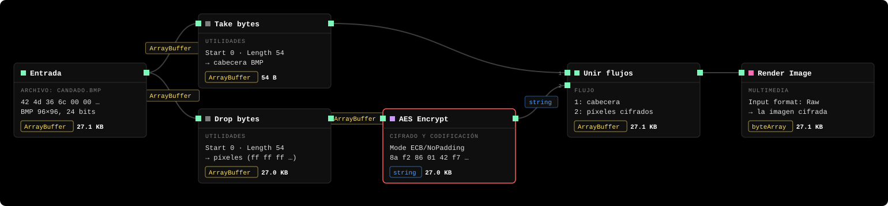
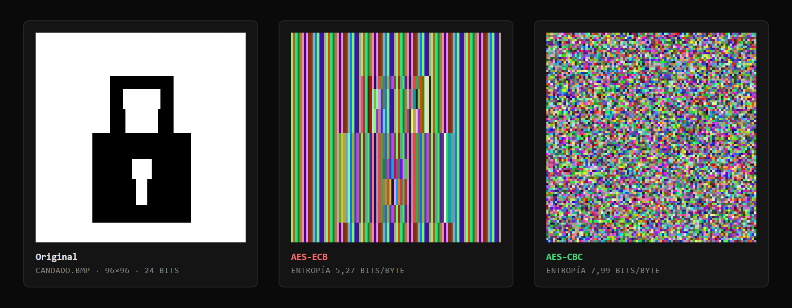
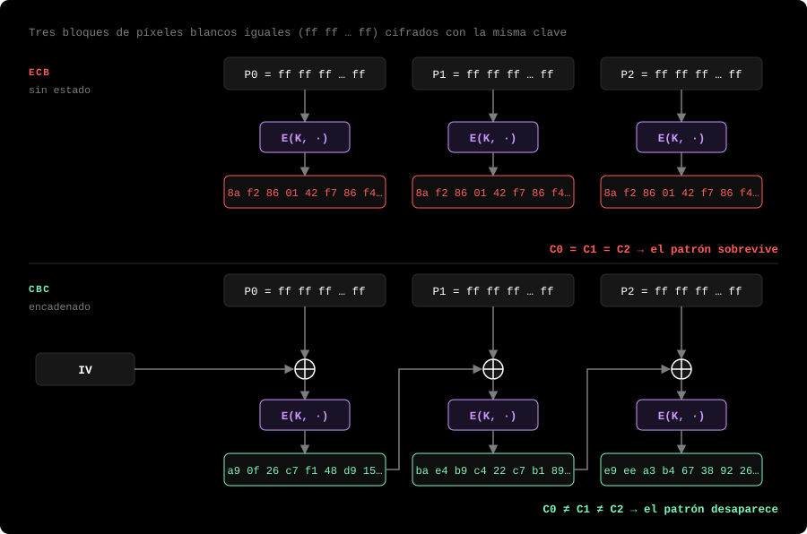
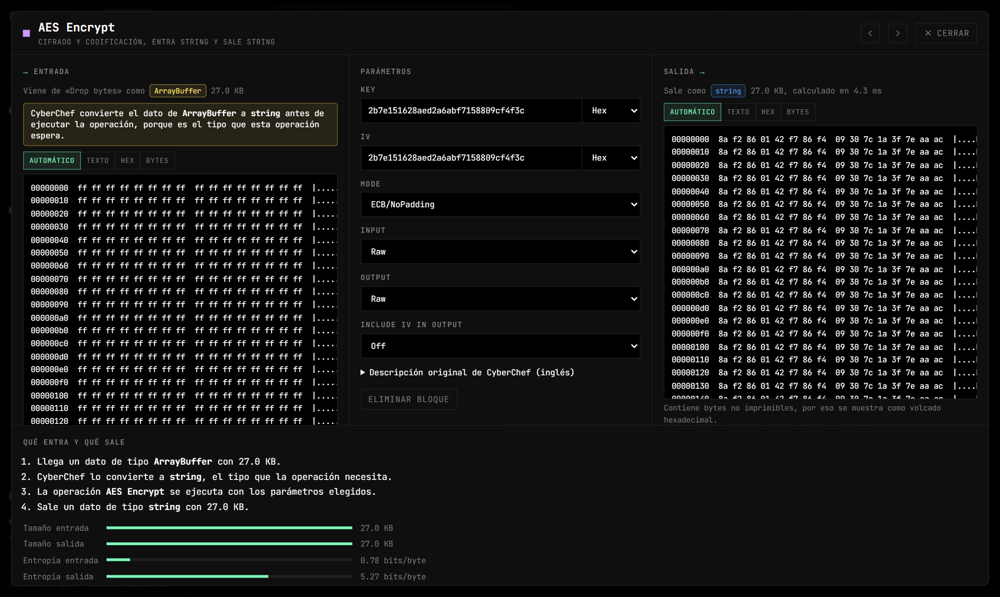
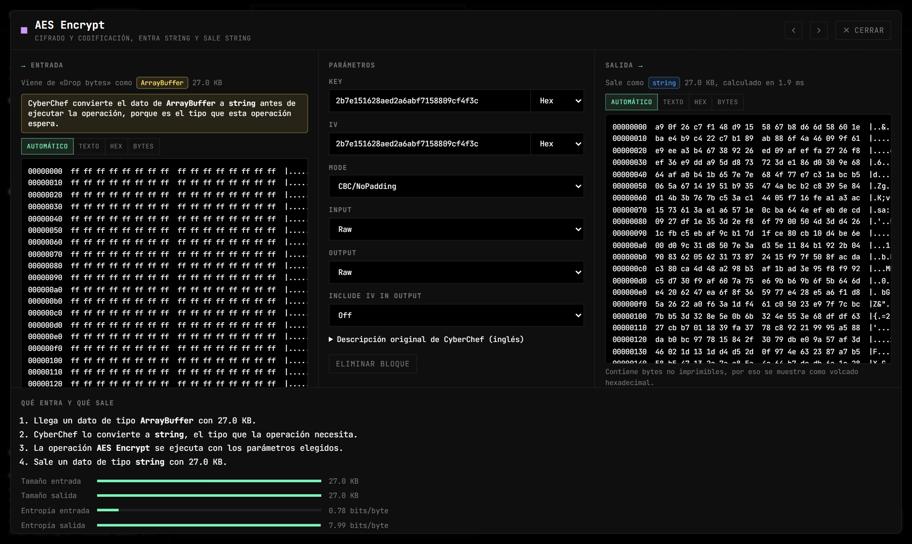

# Lab 1 — El pingüino de ECB

**Vulnerabilidad:** ECB (Electronic Codebook) cifra cada bloque de 16 bytes de forma independiente y determinista. Dos bloques de texto claro iguales producen dos bloques cifrados iguales, así que la estructura del mensaje sobrevive al cifrado. El nombre viene del clásico experimento de cifrar la imagen del pingüino de Linux (Tux): tras ECB, la silueta sigue siendo visible.

## El reto

La imagen de un candado se cifró con AES-ECB y la figura se sigue viendo. Cambia el modo a CBC y explica por qué desaparece.

<p align="center"></p>

## Solución

El flujo ya viene montado al elegir **Laboratorios → 1 · El pingüino de ECB**:



Qué hace cada bloque, con sus parámetros:



Se separan los 54 bytes de cabecera del BMP (que deben quedar intactos para que siga siendo una imagen válida) de los datos de píxel. Solo se cifran los píxeles; luego se vuelve a pegar la cabecera y se renderiza. La imagen es de 96×96 a 24 bits: 27 648 bytes de píxeles, múltiplo exacto de 16, por eso basta con `NoPadding`.

**Con ECB** se reconoce el candado: la imagen tiene grandes zonas de un solo color, es decir, muchísimos bloques de 16 bytes idénticos. ECB los convierte a todos en el mismo bloque cifrado, de modo que las regiones uniformes siguen siendo uniformes y el contorno se dibuja solo. De los 1 728 bloques de la imagen, solo 14 son distintos.

**El paso del reto:** abre el bloque *AES Encrypt* (botón ⤢) y cambia **Mode** de `ECB/NoPadding` a `CBC/NoPadding`. Vuelve a abrir *Render Image* y mira la pestaña **Vista de CyberChef** de la salida: ahora es ruido uniforme, sin figura.



*Las dos imágenes cifradas son la salida real de «Render Image» en CipherFlow, ampliadas sin suavizado. Las franjas verticales de ECB aparecen porque un bloque de 16 bytes no coincide con un número entero de píxeles de 3 bytes; aun así, el candado se distingue perfectamente.*

## Por qué

- ECB: `Cᵢ = E(K, Pᵢ)`. No hay estado entre bloques. `Pᵢ = Pⱼ ⇒ Cᵢ = Cⱼ`.
- CBC: `Cᵢ = E(K, Pᵢ ⊕ Cᵢ₋₁)` (con `C₋₁ = IV`). Cada bloque se mezcla (XOR) con el cifrado anterior antes de cifrarse, así que dos bloques de entrada iguales producen cifrados distintos y el patrón se rompe.



*Los bytes cifrados del diagrama son los primeros de la salida real de AES Encrypt en el lab: un bloque de píxeles blancos (`ff…ff`) siempre da `8a f2 86 01…` en ECB, mientras que en CBC cada bloque sale distinto.*

En CipherFlow puedes comprobarlo en el propio bloque *AES Encrypt*. En **Salida**, con ECB el volcado hexadecimal repite la misma línea `8a f2 86 01 42 f7 86 f4 09 30 7c 1a 3f 7e aa ac` una y otra vez; en **Proceso**, la entropía de salida se queda en **5,27 bits/byte**, lejos de los 8 de unos datos aleatorios:



Con CBC las líneas dejan de repetirse y la entropía sube a **7,99 bits/byte**, indistinguible del azar:



## Verifícalo con otras herramientas

Lo mismo que hace el flujo, con `openssl`, `xxd` y coreutils (ver [requisitos](README.md#verificar-fuera-de-cipherflow)). Primero extrae la imagen del lab desde la raíz del repositorio:

```bash
python3 -c "import json,base64;s=open('src/labs.data.ts',encoding='utf8').read();d=json.loads(s[s.index('{'):s.rindex('}')+1]);open('candado.bmp','wb').write(base64.b64decode(d['ecb']['bmpB64']))"
```

Separa cabecera y píxeles, como *Take bytes* y *Drop bytes*:

```bash
head -c 54 candado.bmp > cabecera.bin      # 54 B
tail -c +55 candado.bmp > pixeles.bin      # 27 648 B
```

Cifra los píxeles en los dos modos (misma clave que el lab; en CBC el lab usa la clave también como IV) y vuelve a pegar la cabecera, como *Unir flujos*:

```bash
K=2b7e151628aed2a6abf7158809cf4f3c
openssl enc -aes-128-ecb -K $K        -nopad -in pixeles.bin -out pix-ecb.bin
openssl enc -aes-128-cbc -K $K -iv $K -nopad -in pixeles.bin -out pix-cbc.bin
cat cabecera.bin pix-ecb.bin > candado-ecb.bmp
cat cabecera.bin pix-cbc.bin > candado-cbc.bmp
```

Abre `candado-ecb.bmp` y `candado-cbc.bmp` con cualquier visor de imágenes: verás lo mismo que en *Render Image*. Los primeros bytes cifrados son los mismos que muestra *AES Encrypt*:

```bash
xxd -s 54 -l 32 candado-ecb.bmp
# 00000036: 8af2 8601 42f7 86f4 0930 7c1a 3f7e aaac  ← el mismo bloque…
# 00000046: 8af2 8601 42f7 86f4 0930 7c1a 3f7e aaac  ← …repetido
xxd -s 54 -l 32 candado-cbc.bmp
# 00000036: a90f 26c7 f148 d915 5867 b8d6 6d58 601e
# 00000046: bae4 b9c4 22c7 b189 ab88 6f4a 4609 9f61
```

Cuenta cuántos bloques de 16 bytes distintos hay (una línea de `xxd -p -c 16` = un bloque):

```bash
xxd -p -c 16 pix-ecb.bin | sort -u | wc -l     # 14   (de 1728)
xxd -p -c 16 pix-cbc.bin | sort -u | wc -l     # 1728 (todos distintos)
xxd -p -c 16 pix-ecb.bin | sort | uniq -c | sort -rn | head -3
#    1202 8af2860142f786f409307c1a3f7eaaac     ← fondo blanco
#     310 7df76b0c1ab899b33e42f047b91b546f     ← cuerpo negro del candado
#      41 96de26c62620b7f35da2aeb7a269a7fb
```

Y la entropía, la misma medida que el panel **Proceso**, con un pequeño script `entropia.py`:

```python
import math, sys
from collections import Counter
d = open(sys.argv[1], 'rb').read()
print(f"{-sum(c/len(d)*math.log2(c/len(d)) for c in Counter(d).values()):.2f} bits/byte")
```

```bash
python3 entropia.py pixeles.bin    # 0.78 bits/byte
python3 entropia.py pix-ecb.bin    # 5.27 bits/byte
python3 entropia.py pix-cbc.bin    # 7.99 bits/byte
```

## Impacto real

ECB no solo afecta imágenes: filtra cualquier estructura repetida (campos fijos de un formato, cabeceras, valores por defecto). Por eso está desaconsejado para prácticamente todo. Un atacante que observa tráfico cifrado con ECB puede deducir cuándo se repite un mensaje o localizar campos conocidos.

## Mitigación

Nunca uses ECB para datos con estructura. Usa un modo autenticado (**AES-GCM**, ChaCha20-Poly1305) que además de ocultar patrones detecta manipulaciones. Si el escenario obliga a CBC, combínalo con un MAC (encrypt-then-MAC) y un IV aleatorio por mensaje. (En este lab el IV es igual a la clave solo para simplificar; en un sistema real eso es otro error.)
