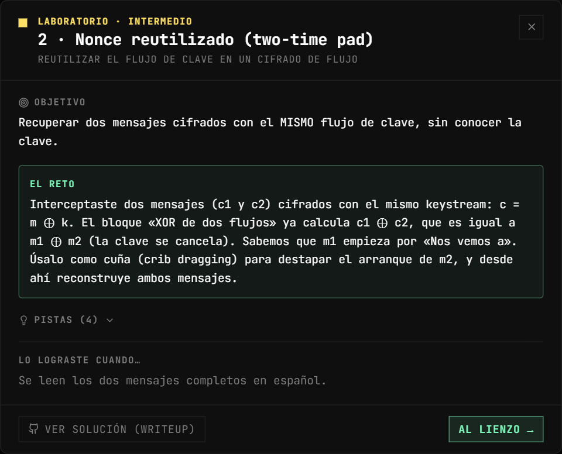
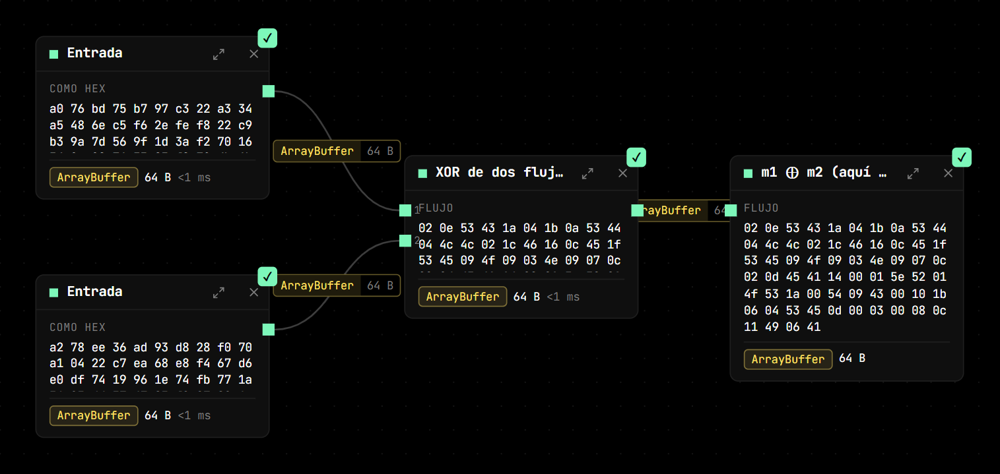
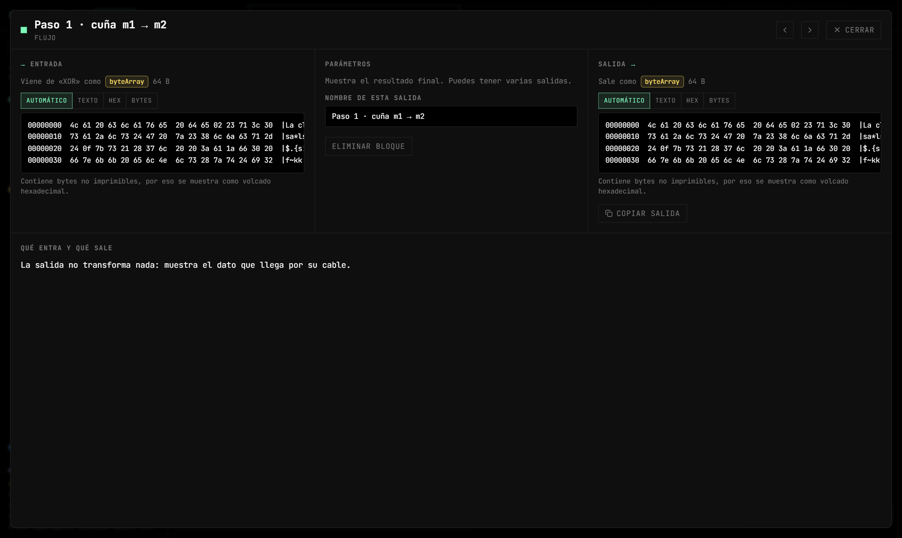
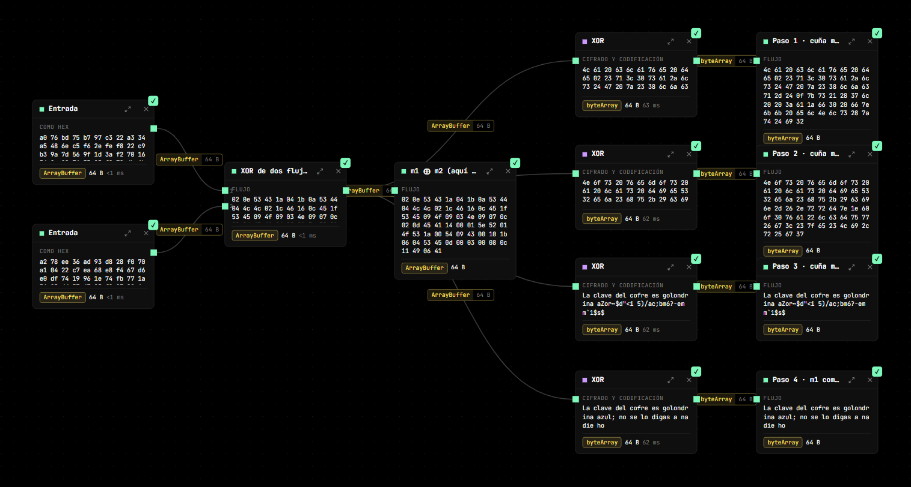
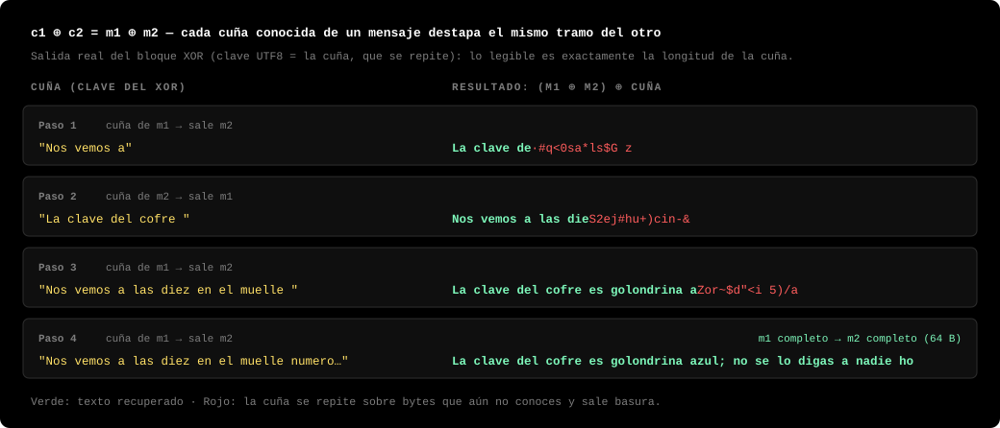
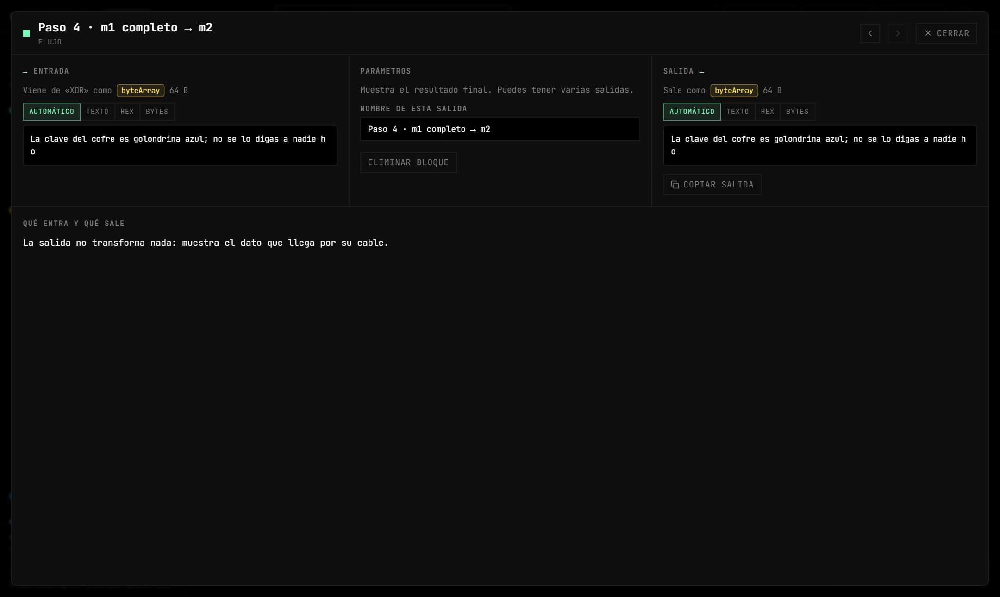

# Lab 2 — Nonce reutilizado (two-time pad)

**Vulnerabilidad:** un cifrado de flujo (RC4, AES-CTR, ChaCha20, o el one-time pad) produce un flujo de clave `k` que se combina con el mensaje mediante XOR: `c = m ⊕ k`. La seguridad depende de que **`k` nunca se repita**. Si dos mensajes se cifran con el mismo `k` (mismo nonce/IV, o la misma semilla), la clave se puede cancelar.

## El reto

Tienes `c1` y `c2` (64 bytes cada uno), cifrados con el mismo keystream. Recupera `m1` y `m2` sin la clave. Sabes que `m1` empieza por «Nos vemos a».

<p align="center"></p>

## Solución

El bloque *XOR de dos flujos* ya calcula:

```
c1 ⊕ c2 = (m1 ⊕ k) ⊕ (m2 ⊕ k) = m1 ⊕ m2
```



El keystream desaparece porque `k ⊕ k = 0`. Queda `m1 ⊕ m2`, que **no** es legible, pero contiene toda la información: si conoces un trozo de uno de los mensajes, obtienes el mismo trozo del otro.

### Crib dragging paso a paso

1. Añade un bloque **XOR** conectado a la salida del *XOR de dos flujos*. En su parámetro **Key** elige el formato **UTF8** y escribe la cuña conocida: `Nos vemos a`.
   El bloque XOR repite la clave a lo largo de todo el dato, así que en los primeros 11 bytes calcula `(m1 ⊕ m2) ⊕ "Nos vemos a"`. Como en esa posición `m1 = "Nos vemos a"`, el resultado es **el arranque de `m2`**: `La clave de`. A partir del byte 11 la clave se repite sobre bytes que no le corresponden y sale basura.

   

2. **Amplía la cuña adivinando.** `La clave de…` pide a gritos `La clave del `, y una clave suele ser de *algo*: prueba `La clave del cofre ` como nueva clave del XOR. Ahora la cuña es un trozo de `m2`, así que lo que sale es `m1`: `Nos vemos a las die`. Si la suposición fuera incorrecta, el lado de `m1` saldría ilegible y sabrías que hay que corregirla.
3. **Alterna.** «las die» se completa como `las diez en el muelle `; úsalo como cuña de `m1` y sale `La clave del cofre es golondrina a…`. Cada trozo revelado de un mensaje destapa el mismo trozo del otro, y el español ayuda: las palabras se completan solas.
4. Con `m1` completo como clave, sale `m2` completo.

Puedes tener todos los intentos a la vez en el lienzo, un bloque XOR por cuña colgando del mismo *XOR de dos flujos*:





Resultado:

- `m1 = "Nos vemos a las diez en el muelle numero siete, trae el maletin."`
- `m2 = "La clave del cofre es golondrina azul; no se lo digas a nadie ho"`



> **Ojo con la longitud.** Los dos cifrados tienen 64 bytes, así que solo se recuperan 64 caracteres de cada mensaje. El `m2` original terminaba en «…a nadie hoy.», pero esos dos últimos caracteres nunca llegaron al cifrado del lab: no hay keystream ni `c2` para ellos.

### Atajo con texto claro conocido

Si conocieras `m1` completo, el flujo de clave se recupera directamente:

```
k = c1 ⊕ m1        (bloque XOR de dos flujos)
m2 = c2 ⊕ k        (otro XOR de dos flujos)
```

y descifras cualquier otro mensaje cifrado con ese mismo `k` (hasta la longitud de `k` que hayas recuperado).

## Verifícalo con otras herramientas

`openssl` no trae un XOR de dos archivos, así que aquí basta con Python (ver [requisitos](README.md#verificar-fuera-de-cipherflow)). Guarda esto como `crib.py`; hace lo mismo que *XOR de dos flujos* seguido de un bloque *XOR* con la cuña como clave:

```python
import sys
c1 = bytes.fromhex('a076bd75b797c322a334a5486ec5f62efef822c9b39a7d569f1d3af27016349e98765385f879db6b111a71cf85f1cb42e7d553e291a379a8cd86905ccf67438a')
c2 = bytes.fromhex('a278ee36ad93d828f070a10422c7ea68e8f467d6e0df7419961e74fb771a3693dd374785f927896a5e496bcfd1f88842f7ce55e6c2e674a8ce869850de2e45cb')
x = bytes(a ^ b for a, b in zip(c1, c2))                         # c1 ⊕ c2 = m1 ⊕ m2
cuna = sys.argv[1].encode()
res = bytes(b ^ cuna[i % len(cuna)] for i, b in enumerate(x))    # la cuña se repite, como en el bloque XOR
print(''.join(chr(c) if 32 <= c < 127 else '.' for c in res))    # '.' = byte no imprimible
```

Y repite los pasos del crib dragging:

```bash
python3 crib.py "Nos vemos a"
# La clave de.#q<0sa*ls$G z#8ljcq-$.{s!(7l  :a.f0 f~kk elNls(zt$i2
python3 crib.py "La clave del cofre "
# Nos vemos a las dieS2ej#hu+)cin-&.rrd~.`o0va"lcduw&g<#.e#Li,r%g7
python3 crib.py "Nos vemos a las diez en el muelle "
# La clave del cofre es golondrina aZor~$d"<i 5)/ac;bm6?-em m`1$s$
python3 crib.py "Nos vemos a las diez en el muelle numero siete, trae el maletin."
# La clave del cofre es golondrina azul; no se lo digas a nadie ho
```

Prueba también una cuña equivocada, por ejemplo `python3 crib.py "Hola amigo"`: el principio sale ilegible y sabes que esa suposición no encaja.

## Por qué

XOR es su propia inversa y es asociativo/conmutativo. Toda la seguridad del one-time pad vive en que `k` sea aleatorio y de un solo uso. Reutilizarlo una vez lo degrada a un cifrado de sustitución sobre `m1 ⊕ m2`, que se rompe con estadística y cuñas.

## Impacto real

Es un patrón recurrente: el **WEP** de Wi-Fi reutilizaba IVs de 24 bits de RC4; **Microsoft Office** y **PPTP** tuvieron fallos de nonce; y muchos usos incorrectos de **AES-CTR** o **GCM** repiten el nonce. Repetir el nonce en GCM es aún peor: además de exponer los textos, permite recuperar la clave de autenticación.

## Mitigación

Nonce único por mensaje, siempre. Genera el nonce de forma aleatoria (96 bits en GCM) o con un contador que nunca se reinicie con la misma clave. Rota la clave antes de agotar el espacio de nonces.
