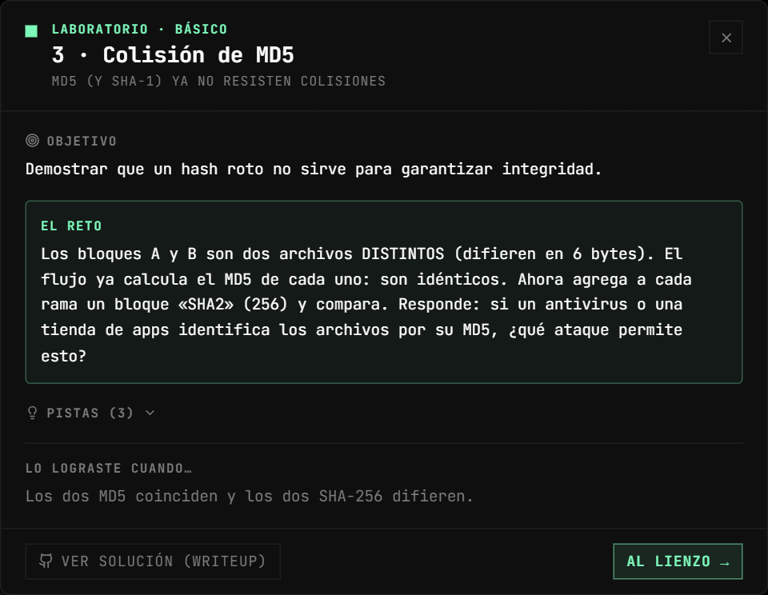
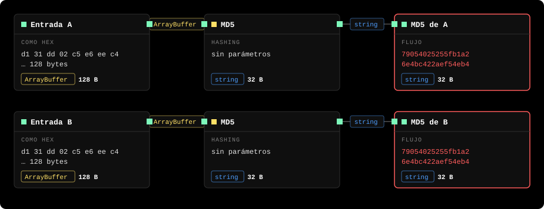
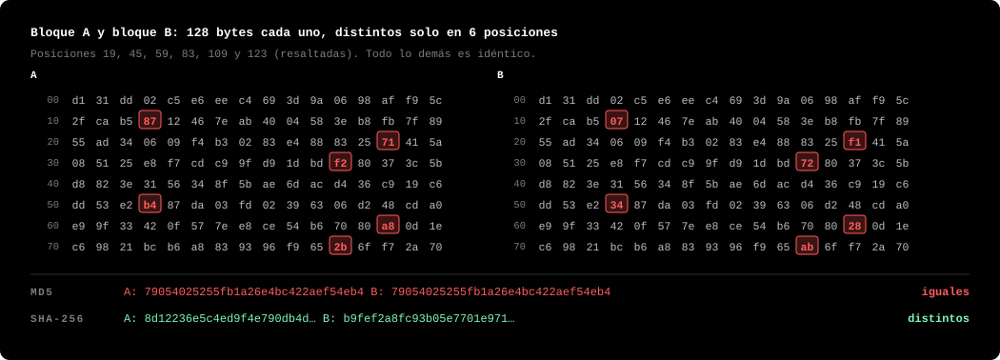
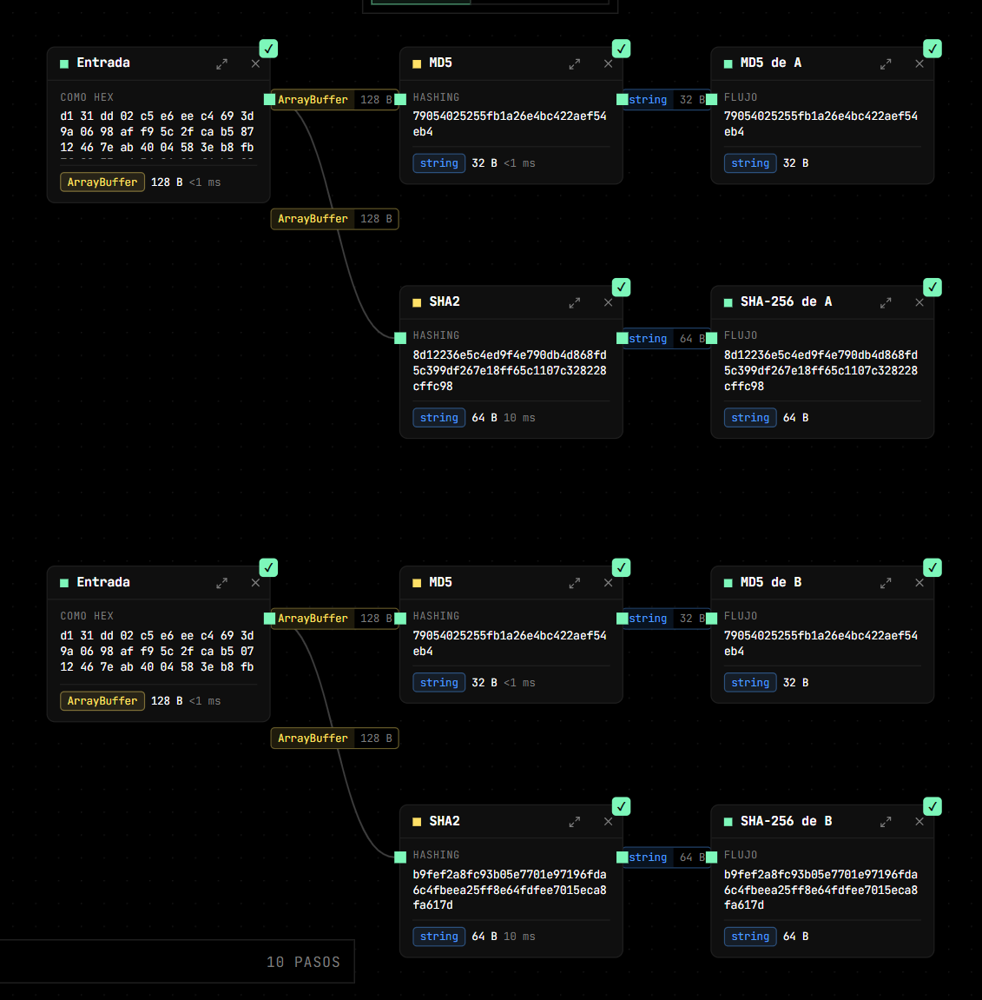
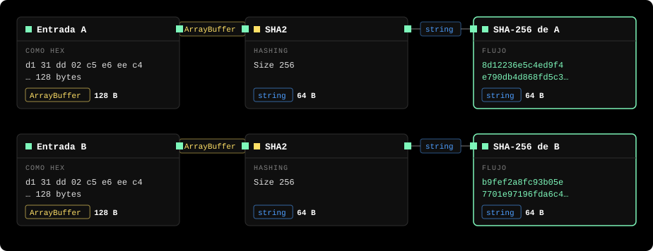

# Lab 3 — Colisión de MD5

**Vulnerabilidad:** una función hash criptográfica debe ser *resistente a colisiones*: debe ser inviable encontrar dos entradas distintas con el mismo hash. MD5 se rompió en 2004 (Wang et al.) y hoy se generan colisiones en segundos. SHA-1 cayó en 2017 (ataque *SHAttered* de Google). Un hash sin resistencia a colisiones no sirve para integridad ni para firmas.

## El reto

Los bloques A y B son dos archivos distintos (difieren en 6 bytes). Demuestra que MD5 no distingue archivos y explica qué ataque habilita.

<p align="center"></p>

## Solución

El flujo calcula `MD5(A)` y `MD5(B)`:



**Idénticos**, aunque A ≠ B. Este es el par clásico de Wang et al.: dos bloques que difieren en las posiciones 19, 45, 59, 83, 109 y 123. Puedes verlo abriendo cada *Entrada* y comparando su volcado hexadecimal:



**El paso del reto:** agrega a cada rama un bloque **SHA2** (Size `256`, el valor por defecto) conectado a su *Entrada*, y una *Salida* para verlo. El lienzo queda así:



Aislando solo las ramas nuevas:



SHA-256 sí los distingue: dos hashes completamente diferentes. La conclusión es directa: si un sistema identifica archivos por su MD5, dos archivos distintos le parecen el mismo.

## Por qué importan las 6 diferencias

MD5 procesa el mensaje en bloques de 64 bytes; A y B ocupan dos bloques cada uno. La colisión no es casual: los seis bytes que cambian están calculados para que las diferencias se cancelen dentro de la función de compresión de MD5 (rutas diferenciales): el primer bloque introduce una diferencia controlada en el estado interno y el segundo la anula. Al terminar, el estado es idéntico y el hash también. Como MD5 encadena bloques, además se puede añadir cualquier sufijo común a A y B y seguirán colisionando.

El ataque de Wang produce pares como este; el de **prefijo elegido** (*chosen-prefix collision*, Stevens 2007) va más allá: parte de dos prefijos arbitrarios distintos y calcula bloques que hacen colisionar ambos. Eso es lo que permitió falsificar un certificado de CA real.

## Verifícalo con otras herramientas

Crea los dos archivos a partir del hex de las *Entradas* (ver [requisitos](README.md#verificar-fuera-de-cipherflow)):

```bash
echo d131dd02c5e6eec4693d9a0698aff95c2fcab58712467eab4004583eb8fb7f8955ad340609f4b30283e488832571415a085125e8f7cdc99fd91dbdf280373c5bd8823e3156348f5bae6dacd436c919c6dd53e2b487da03fd02396306d248cda0e99f33420f577ee8ce54b67080a80d1ec69821bcb6a8839396f9652b6ff72a70 | xxd -r -p > a.bin
echo d131dd02c5e6eec4693d9a0698aff95c2fcab50712467eab4004583eb8fb7f8955ad340609f4b30283e4888325f1415a085125e8f7cdc99fd91dbd7280373c5bd8823e3156348f5bae6dacd436c919c6dd53e23487da03fd02396306d248cda0e99f33420f577ee8ce54b67080280d1ec69821bcb6a8839396f965ab6ff72a70 | xxd -r -p > b.bin
```

Compáralos byte a byte:

```bash
cmp -l a.bin b.bin
#  20 207   7
#  46 161 361
#  60 362 162
#  84 264  64
# 110 250  50
# 124  53 253
```

`cmp -l` cuenta las posiciones desde 1 y muestra los valores en **octal**: `20 207 7` es la posición 19 (contando desde 0, como el volcado de CipherFlow), con `0x87` en A y `0x07` en B. Son las 6 diferencias del diagrama.

Los hashes, con coreutils o con `openssl dgst`:

```bash
md5sum a.bin b.bin
# 79054025255fb1a26e4bc422aef54eb4  a.bin
# 79054025255fb1a26e4bc422aef54eb4  b.bin      ← iguales
sha256sum a.bin b.bin
# 8d12236e5c4ed9f4e790db4d868fd5c399df267e18ff65c1107c328228cffc98  a.bin
# b9fef2a8fc93b05e7701e97196fda6c4fbeea25ff8e64fdfee7015eca8fa617d  b.bin
openssl dgst -sha1 a.bin b.bin
# SHA1(a.bin)= a34473cf767c6108a5751a20971f1fdfba97690a
# SHA1(b.bin)= 4283dd2d70af1ad3c2d5fdc917330bf502035658
```

SHA-1 también los distingue: esta colisión está fabricada específicamente contra MD5. Las colisiones de SHA-1 existen (SHAttered), pero hay que construirlas contra SHA-1.

Para ver el ataque de sufijo común en acción, añade los mismos bytes al final de ambos archivos y vuelve a calcular: los MD5 siguen coincidiendo.

```bash
printf 'cualquier sufijo' | tee -a a.bin >> b.bin
md5sum a.bin b.bin        # de nuevo iguales (aunque distintos de 7905…)
```

## Impacto real

- **Certificados X.509 falsos:** en 2008 se creó un certificado de CA fraudulento con el mismo MD5 que uno legítimo.
- **Flame (2012):** malware que falsificó una firma de Microsoft usando una colisión de MD5 para aparentar ser una actualización de Windows.
- **Integridad rota:** un `md5sum` que coincide ya no garantiza que un archivo no fue sustituido.

## Mitigación

No uses MD5 ni SHA-1 para nada que dependa de resistencia a colisiones (firmas, certificados, verificación de descargas, deduplicación con implicaciones de seguridad). Usa **SHA-256** o superior. Para autenticar mensajes con clave, usa **HMAC** (ver el Lab 5 y el ejemplo «SHA-256 y HMAC»; el bloque *SHA2* de CipherFlow tiene además la explicación paso a paso en su panel **Proceso**). MD5 solo sobrevive como suma de verificación no adversarial (detectar corrupción accidental).
