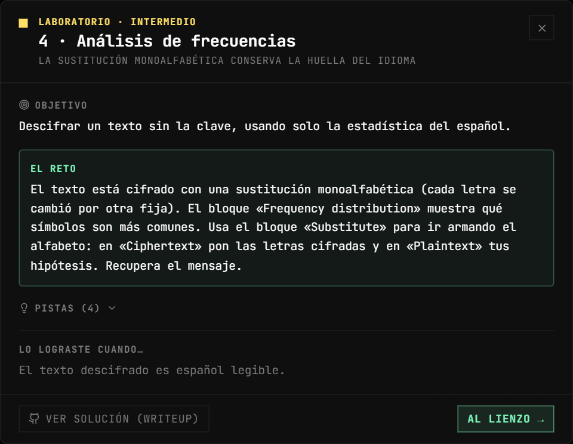
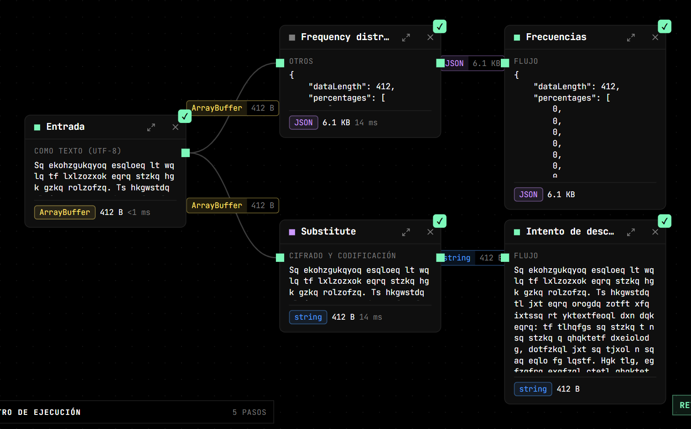
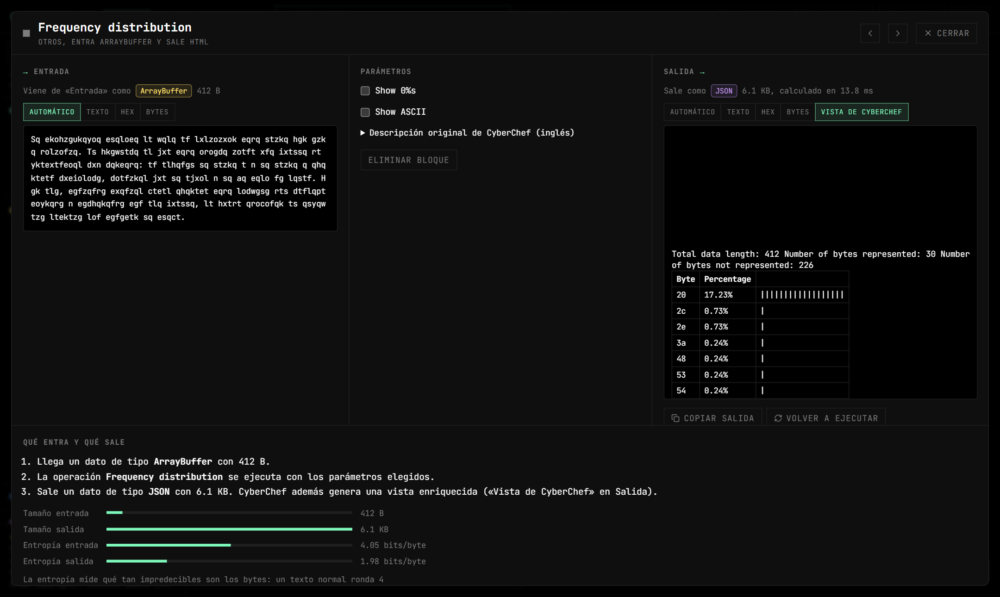
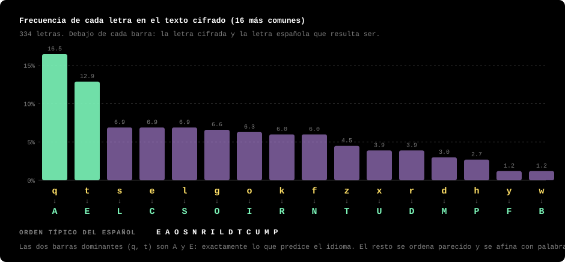
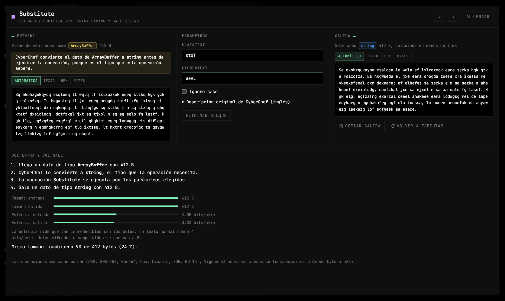
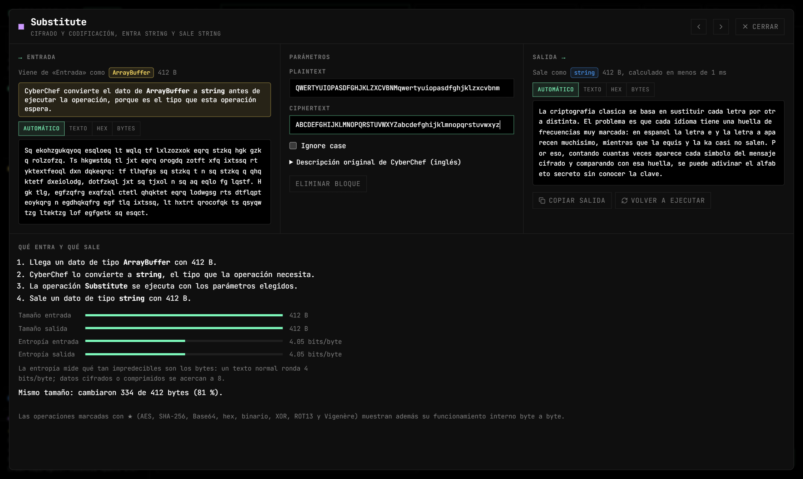

# Lab 4 — Análisis de frecuencias

**Vulnerabilidad:** un cifrado de sustitución monoalfabética reemplaza cada letra por otra fija. Hay 26! ≈ 4×10²⁶ claves posibles, así que la fuerza bruta es inviable… pero la sustitución **no oculta la estadística del idioma**. En español la E y la A son con diferencia las más frecuentes; esa huella pasa intacta al texto cifrado y delata la clave.

## El reto

Descifra el texto sin la clave, usando solo las frecuencias del español. El bloque *Frequency distribution* te da el conteo; el bloque *Substitute* aplica tu mapa.

<p align="center"></p>



## Solución

1. **Mira las frecuencias.** Abre el bloque *Frequency distribution* y, en **Salida**, la pestaña **Vista de CyberChef**. La tabla está ordenada por valor de byte (en hexadecimal: `71` = `q`, `74` = `t`…); marca **Show ASCII** en sus parámetros si prefieres ver el carácter. El espacio (`20`) domina con un 17 %; entre las letras, busca las barras más largas.

   

   Ordenadas de mayor a menor, las letras del cifrado quedan así:

   

2. **Empareja por frecuencia.** Orden aproximado en español: `E A O S N R I L D T C U M P`. Dos letras destacan claramente: `q` (16,5 %) y `t` (12,9 %). Son A y E. A partir de ahí las frecuencias se parecen mucho entre sí (`s`, `e`, `l` empatan al 6,9 %), así que el orden ya no basta: toca usar la estructura.
3. **Usa la estructura.** Las palabras de una letra son A, E, O o Y. Las de dos muy repetidas: DE, LA, EL, EN, SE. Los dígrafos frecuentes (QU, CH, RR) y las terminaciones (-CIÓN, -MENTE, -ADO) confirman letras. Por ejemplo, el texto contiene `sq` y `t` sueltas: si `q` = A y `t` = E, `sq` es «LA», y `s` = L.
4. **Aplica el mapa con *Substitute*.** Este bloque cambia cada carácter de **Plaintext** por el carácter de la misma posición en **Ciphertext**. Para *descifrar*, por tanto:
   - en **Plaintext** van las letras **cifradas**;
   - en **Ciphertext** van tus **hipótesis** (las letras en claro).

   Los nombres de los campos engañan: piensa en ellos como «de» y «a». La opción *Ignore case* está desactivada, así que incluye minúsculas y mayúsculas.

   Con solo las dos primeras hipótesis (`qtQT` → `aeAE`) aparecen palabras sueltas como «a», «e» y «Es», y los huecos invitan a seguir (`sa sezka` pide ser «la letra»):

   

   Ve añadiendo pares a medida que confirmas letras. La clave completa (que reconstruyes, no la conoces de antemano) es:

   ```
   Plaintext  (cifradas):  QWERTYUIOPASDFGHJKLZXCVBNMqwertyuiopasdfghjklzxcvbnm
   Ciphertext (en claro):  ABCDEFGHIJKLMNOPQRSTUVWXYZabcdefghijklmnopqrstuvwxyz
   ```

   Es decir, el cifrado usó el alfabeto del teclado QWERTY: A→Q, B→W, C→E…

   

   > Si pones las cadenas al revés (el alfabeto QWERTY en *Ciphertext*), Substitute **vuelve a cifrar** el texto en lugar de descifrarlo y la salida es otro galimatías: `Lj tagimuxajngj tljsgtj…`.

El mensaje descifrado es:

> «La criptografia clasica se basa en sustituir cada letra por otra distinta. El problema es que cada idioma tiene una huella de frecuencias muy marcada: en espanol la letra e y la letra a aparecen muchisimo…»

El propio texto describe la técnica que lo rompe.

## Verifícalo con otras herramientas

Con coreutils basta (ver [requisitos](README.md#verificar-fuera-de-cipherflow)). Copia el texto de la *Entrada* a `cifrado.txt`, o extráelo desde la raíz del repositorio:

```bash
python3 -c "import json;s=open('src/labs.data.ts',encoding='utf8').read();d=json.loads(s[s.index('{'):s.rindex('}')+1]);open('cifrado.txt','w').write(d['sub']['cipher'])"
```

Frecuencia de cada letra, de mayor a menor (el equivalente de *Frequency distribution*, pero ordenado):

```bash
tr -cd 'a-zA-Z' < cifrado.txt | tr 'A-Z' 'a-z' | fold -w1 | sort | uniq -c | sort -rn | head -6
#      55 q
#      43 t
#      23 s
#      23 l
#      23 e
#      22 g
```

`tr` funciona igual que *Substitute*: cambia cada carácter del primer conjunto por el de la misma posición en el segundo. Por eso el orden es el mismo que en la app, **cifradas primero**:

```bash
tr 'qtQT' 'aeAE' < cifrado.txt                  # primeras hipótesis
# Sa ekohzgukayoa esaloea le wala ef lxlzozxok eara sezka hgk gzka rolzofza. Es hk…
tr 'QWERTYUIOPASDFGHJKLZXCVBNMqwertyuiopasdfghjklzxcvbnm' \
   'ABCDEFGHIJKLMNOPQRSTUVWXYZabcdefghijklmnopqrstuvwxyz' < cifrado.txt
# La criptografia clasica se basa en sustituir cada letra por otra distinta. El problema…
```

## Vigenère y el índice de coincidencia

La sustitución **polialfabética** (Vigenère) reparte varias sustituciones según una clave, lo que aplana el histograma y frena el análisis de frecuencias directo. Pero se rompe en dos pasos:

1. **Longitud de la clave** con el **índice de coincidencia** (bloque *Index of Coincidence*): se prueban distintos tamaños; cuando el texto se parte en columnas del tamaño correcto, cada columna es una sustitución simple y su IC se acerca al del idioma (≈ 0,072 en español) en vez del de texto aleatorio (≈ 0,038).
2. **Cada columna** se resuelve como un César con análisis de frecuencias, y el bloque *Vigenère Decode* aplica la clave hallada. (Puedes practicarlo con el ejemplo «Clásicos: ROT13 y Vigenère».)

## Impacto real

Ninguno de estos cifrados ofrece seguridad hoy; su valor es didáctico e histórico (la máquina Enigma es, en el fondo, una sustitución polialfabética muy elaborada, y cayó por análisis estadístico y errores de operación). Enseñan el principio central: **un cifrado que preserva estructura estadística es vulnerable**.

Fíjate en el panel **Proceso** de *Substitute*: la entropía de entrada y de salida es la misma (4,05 bits/byte). La sustitución solo cambia los nombres de los símbolos; la distribución, que es lo que delata el idioma, no se mueve.

## Mitigación

Los cifrados modernos producen salida indistinguible de aleatoria (difusión y confusión de Shannon): en CipherFlow, cifra un texto con AES y verás en el panel *Proceso* que su entropía se acerca a 8 bits/byte y el análisis de frecuencias se vuelve plano. Esa es la propiedad que le falta a la sustitución.
