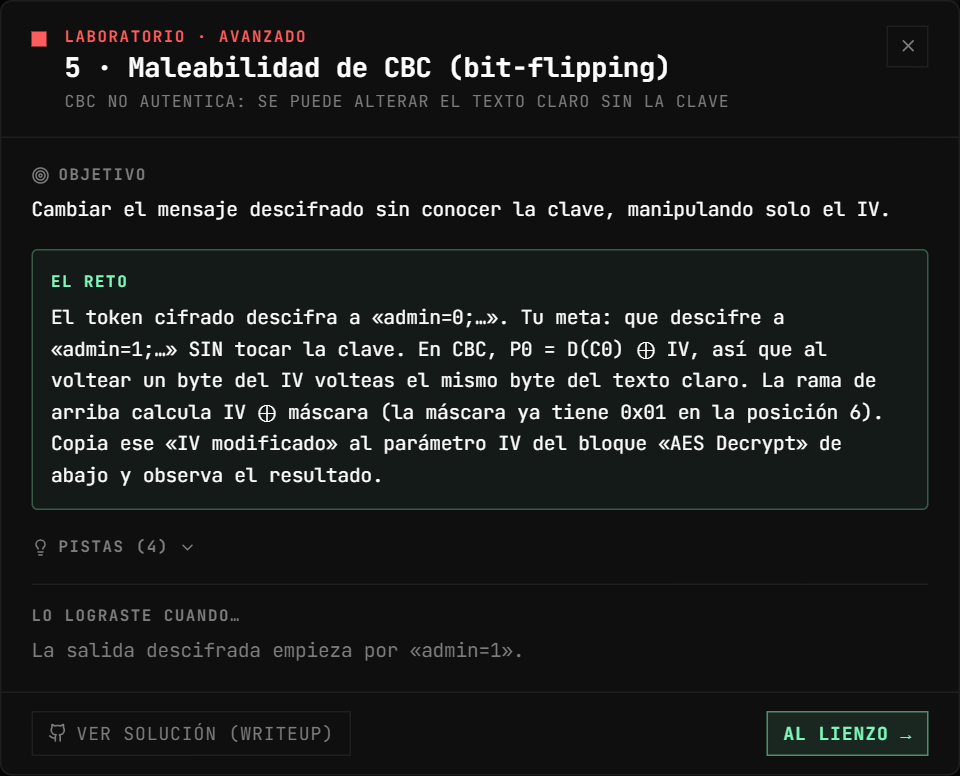
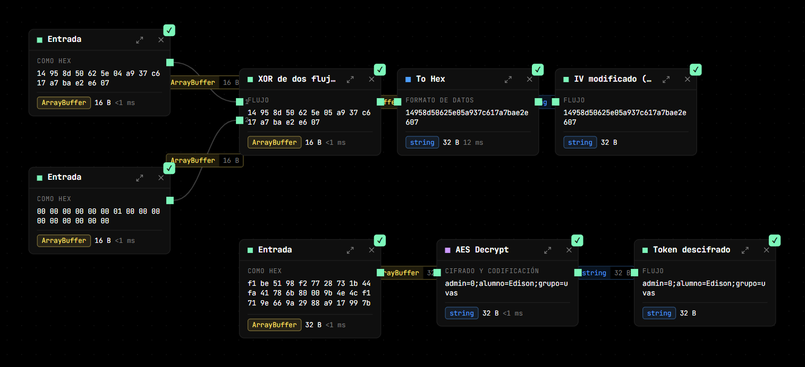
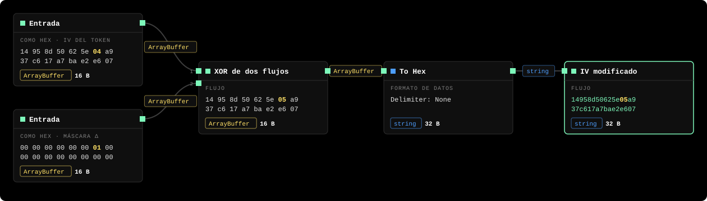
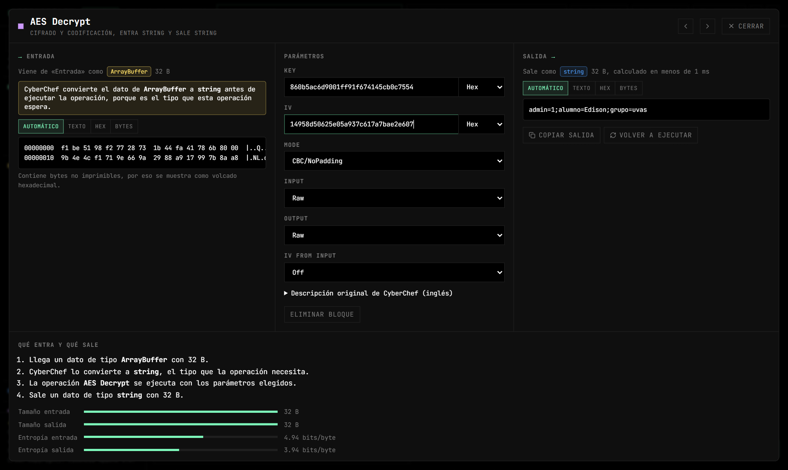
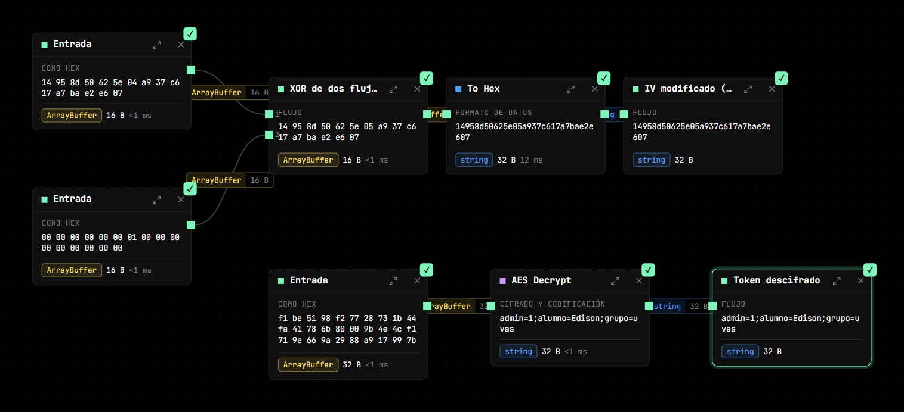
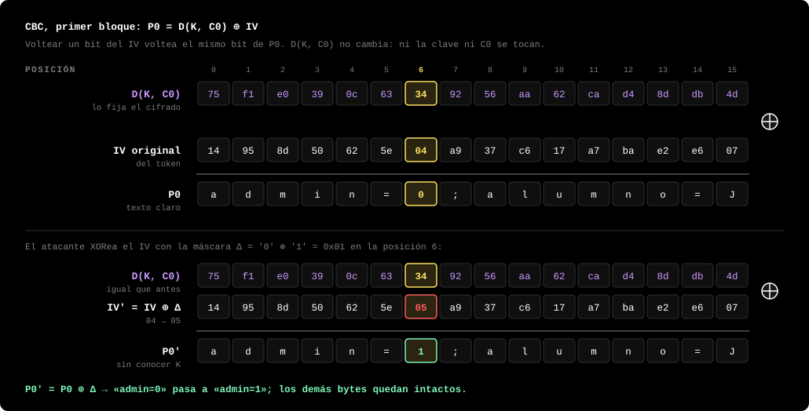

# Lab 5 — Maleabilidad de CBC (bit-flipping)

**Vulnerabilidad:** el cifrado sin autenticar es *maleable*: un atacante puede modificar el texto cifrado para provocar cambios **predecibles** en el texto claro, sin conocer la clave. En CBC el descifrado del primer bloque es `P₀ = D(K, C₀) ⊕ IV`. Como el IV se combina con XOR, voltear un bit del IV voltea el mismo bit del texto claro. Esta maleabilidad es la base de ataques mayores, como el **padding oracle** (POODLE, Lucky13, el fallo de ASP.NET de 2010).

## El reto

El token cifrado descifra a `admin=0;alumno=Edison;grupo=uvas`. Consigue que descifre a `admin=1;…` **sin tocar la clave**.

<p align="center"></p>



## Solución

El objetivo es el byte en la posición 6 del texto claro: `'0'` (0x30) debe volverse `'1'` (0x31).

```
Δ = '0' ⊕ '1' = 0x30 ⊕ 0x31 = 0x01
```

Como ese byte está en el primer bloque, se manipula el **IV** en esa misma posición. La rama superior del flujo ya lo calcula:



`IV' = IV ⊕ máscara` cambia solo el byte 6 del IV (resaltado): `04` pasa a `05`. El resto del IV queda igual.

**El paso del reto:** copia el valor de *IV modificado* (botón **Copiar salida** en su detalle) y pégalo en el parámetro **IV** (formato Hex) del bloque *AES Decrypt* de abajo:



El resultado pasa a:

```
admin=1;alumno=Edison;grupo=uvas
```



Solo cambió `admin=0` → `admin=1`. El resto del mensaje queda intacto, porque el IV únicamente afecta al primer bloque.

> El bloque de descifrado tiene la clave solo para que **veas** el efecto. El atacante real no la conoce ni la necesita: manipula el mensaje a ciegas, confiando en que sabe dónde está el byte objetivo.

## Por qué

En CBC:

```
P₀  = D(K, C₀) ⊕ IV
P'₀ = D(K, C₀) ⊕ IV'  = D(K, C₀) ⊕ (IV ⊕ Δ) = P₀ ⊕ Δ
```

`D(K, C₀)` no cambia porque ni la clave ni `C₀` se tocan. El XOR con `Δ` se traslada directamente al texto claro:



*Los valores son los reales del lab. En la posición 6, `D(K, C₀) = 0x34`: con el IV original `0x34 ⊕ 0x04 = 0x30` ('0'); con el IV modificado `0x34 ⊕ 0x05 = 0x31` ('1').*

Si el byte objetivo estuviera en el bloque `n`, se voltearía el mismo byte de `Cₙ₋₁` en su lugar (a costa de convertir el bloque `n-1` en basura, un compromiso habitual del ataque).

## Verifícalo con otras herramientas

Con `openssl`, `xxd` y bash (ver [requisitos](README.md#verificar-fuera-de-cipherflow)). Descifra el token original:

```bash
K=860b5ac6d9001ff91f674145cb0c7554
IV=14958d50625e04a937c617a7bae2e607
echo f1be5198f27728731b44fa41786b80009b4e4cf1719e669a2988a917997b8aa8 | xxd -r -p > token.bin
openssl enc -d -aes-128-cbc -K $K -iv $IV -nopad -in token.bin
# admin=0;alumno=Edison;grupo=uvas
```

Calcula `IV' = IV ⊕ Δ` en el byte 6 (caracteres 12–13 de la cadena hex) y descifra con él:

```bash
IV2=$(printf '%s%02x%s' ${IV:0:12} $((0x${IV:12:2} ^ 0x01)) ${IV:14})
echo $IV2
# 14958d50625e05a937c617a7bae2e607
openssl enc -d -aes-128-cbc -K $K -iv $IV2 -nopad -in token.bin
# admin=1;alumno=Edison;grupo=uvas
```

> **¿Por qué `-nopad`?** El token son exactamente 32 bytes sin relleno PKCS#7 (en CipherFlow, modo `CBC/NoPadding`). Si lo quitas, `openssl` busca un relleno válido al final, no lo encuentra y responde `bad decrypt`. Justo esa diferencia entre «relleno válido» y «relleno inválido», si un servidor la deja ver, es el oráculo del ataque de la sección siguiente.

**Reto extra: cambiar el segundo bloque.** Para tocar bytes del bloque 1 hay que voltear el mismo byte de `C₀`. Así se cambia `grupo=uvas` por `grupo=kiwi` (posiciones 28–31, es decir, 12–15 dentro del bloque 1):

```bash
python3 -c "c=bytearray(open('token.bin','rb').read());d=bytes(a^b for a,b in zip(b'uvas',b'kiwi'));c[12:16]=bytes(x^y for x,y in zip(c[12:16],d));open('token2.bin','wb').write(c)"
openssl enc -d -aes-128-cbc -K $K -iv $IV -nopad -in token2.bin | xxd
# 00000000: 3304 057c e0b7 392c 449b 2991 9ce7 4168  3..|..9,D.)...Ah   ← bloque 0 destruido
# 00000010: 6469 736f 6e3b 6772 7570 6f3d 6b69 7769  dison;grupo=kiwi   ← bloque 1 a la carta
```

El bloque 1 queda exactamente como quería el atacante, pero el bloque 0 se convierte en basura: ese es el compromiso del que habla la sección anterior.

**La mitigación, comprobada.** `openssl enc` no admite modos AEAD (con `-aes-128-gcm` responde `AEAD ciphers not supported`), así que usa Node, que ya necesitas para CipherFlow. Guarda esto como `gcm.js` y ejecútalo con `node gcm.js`:

```js
const crypto = require('node:crypto')
const key = Buffer.from('860b5ac6d9001ff91f674145cb0c7554', 'hex'), iv = crypto.randomBytes(12)
const enc = crypto.createCipheriv('aes-128-gcm', key, iv)
const ct = Buffer.concat([enc.update('admin=0;alumno=Edison;grupo=uvas'), enc.final()]), tag = enc.getAuthTag()
const abrir = c => { const d = crypto.createDecipheriv('aes-128-gcm', key, iv); d.setAuthTag(tag); return Buffer.concat([d.update(c), d.final()]).toString() }
console.log('original :', abrir(ct))
const mod = Buffer.from(ct); mod[6] ^= 0x01                    // el mismo volteo de bit que en CBC
try { console.log('alterado :', abrir(mod)) } catch (e) { console.log('alterado :', e.message) }
```

```
original : admin=0;alumno=Edison;grupo=uvas
alterado : Unsupported state or unable to authenticate data
```

GCM cifra en modo contador, así que el volteo sí cambiaría `'0'` por `'1'` en el texto claro, pero la etiqueta ya no coincide y el mensaje se rechaza antes de entregarlo.

## Del bit-flipping al padding oracle

Este lab muestra el *primitivo*. El **padding oracle** lo convierte en un descifrado completo: si el servidor revela (por un mensaje de error o por el tiempo de respuesta) si el relleno PKCS#7 de un mensaje es válido, el atacante ajusta byte a byte el bloque anterior hasta forzar un relleno válido y, de ahí, deduce `D(K, Cᵢ)` y por tanto el texto claro —sin la clave—. Es adaptativo (cientos de consultas por bloque), por eso no se resuelve en un grafo estático como este; pero descansa exactamente en la maleabilidad que acabas de explotar.

## Impacto real

- **POODLE (2014):** padding oracle sobre SSL 3.0 con CBC.
- **Lucky Thirteen (2013):** oracle por tiempo en TLS.
- **ASP.NET (2010):** padding oracle que permitía leer archivos y forjar cookies.
- **Cookies de sesión** cifradas con CBC sin MAC: bit-flipping para escalar privilegios, justo como este `admin=0` → `admin=1`.

## Mitigación

Usa **cifrado autenticado (AEAD)**: AES-GCM o ChaCha20-Poly1305. Añaden una etiqueta que se verifica antes de descifrar, así que cualquier bit alterado se detecta y el mensaje se rechaza. Pruébalo en CipherFlow: cifra un texto con *AES Encrypt* en modo **GCM** (Output `Hex`); la salida trae el cifrado y, debajo, una línea `Tag: …`. Pasa ese cifrado a *AES Decrypt* en modo GCM (Input `Hex`) con el tag en el parámetro **GCM Tag** y descifra bien. Ahora cambia un solo dígito del cifrado o del IV: en vez de entregar un texto claro manipulado, el bloque falla con *Unable to decrypt input with these parameters*. Si no puedes usar AEAD, aplica **encrypt-then-MAC** con un MAC de tiempo constante.
